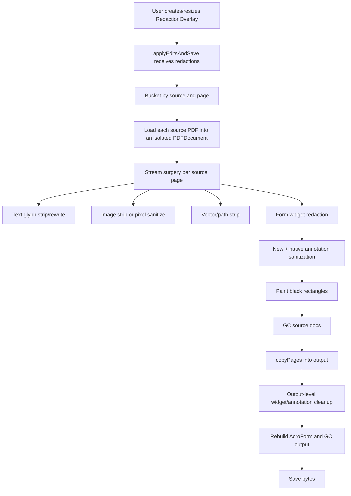
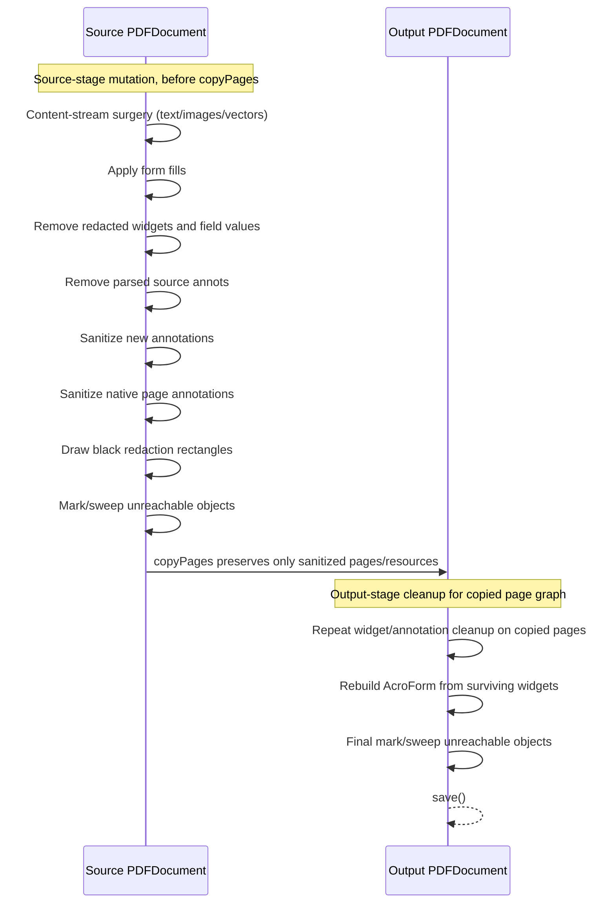
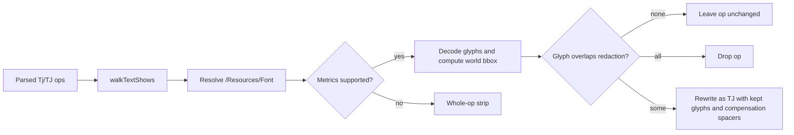

# Redaction pipeline

This document explains how rihaPDF turns an in-editor redaction rectangle into an irreversible saved-PDF redaction. It is written for future maintainers who need to change the save path without accidentally leaving recoverable text, images, annotations, form values, or dead PDF objects behind.

Source references are repo-relative and include line numbers from the implementation at the time this document was written.

## Design goal

A rihaPDF redaction is **not** a PDF annotation and not just a black overlay. The UI preview is intentionally lightweight: it draws a black rectangle over the live canvas, but the original PDF canvas still contains the underlying content until save. The save pipeline must therefore:

1. Remove or sanitize all source content that intersects the rectangle.
2. Draw an opaque black rectangle into the saved page content stream.
3. Remove now-unreachable PDF objects so sensitive streams are not serialized anyway.

The data model is a PDF-space rectangle with source identity and page index: `Redaction = PdfRect & { id, sourceKey, pageIndex }` (`src/domain/redactions.ts:22`). The overlay component documents the same distinction: preview-only black rectangle in the editor; save-time stream stripping plus rectangle painting for the actual PDF (`src/components/PdfPage/overlays/RedactionOverlay.tsx:6`, `src/components/PdfPage/overlays/RedactionOverlay.tsx:26`).

## High-level flow



The orchestration entry point is `applyEditsAndSave`. Redactions are registered as source-loading triggers and bucketed per source (`src/pdf/save/orchestrator.ts:40`, `src/pdf/save/orchestrator.ts:97`). Content-stream surgery is then run once per loaded source when edits, moves, shape deletes, or redactions are present (`src/pdf/save/orchestrator.ts:156`, `src/pdf/save/orchestrator.ts:165`).

## Ordering contract

The ordering is deliberate. If you change it, verify every category below still has no recoverable bytes.



Key source-stage calls:

- Form widgets are removed before `copyPages`, because AcroForm field values and appearances live outside page content streams (`src/pdf/save/orchestrator.ts:322`, `src/pdf/save/orchestrator.ts:330`).
- New annotations are sanitized before they are applied to the source docs (`src/pdf/save/orchestrator.ts:339`).
- Native page annotations are sanitized before `copyPages` preserves them (`src/pdf/save/orchestrator.ts:359`, `src/pdf/save/orchestrator.ts:372`).
- Black rectangles are appended after destructive cleanup, so the saved PDF has an opaque visual mark but no hidden content underneath (`src/pdf/save/orchestrator.ts:381`, `src/pdf/save/orchestrator.ts:391`).
- Each source document is garbage-collected before it can be copied (`src/pdf/save/orchestrator.ts:403`, `src/pdf/save/orchestrator.ts:404`).

Key output-stage calls:

- Pages are copied in slot order using `output.copyPages(...)` (`src/pdf/save/orchestrator.ts:425`, `src/pdf/save/orchestrator.ts:429`).
- Redaction cleanup is repeated on the output pages for copied widget/annotation graphs (`src/pdf/save/orchestrator.ts:462`, `src/pdf/save/orchestrator.ts:463`).
- `/AcroForm` is rebuilt only from surviving widgets, then the output object table is garbage-collected (`src/pdf/save/orchestrator.ts:472`, `src/pdf/save/orchestrator.ts:473`).

## Content-stream surgery

`applyStreamSurgeryForSource` is the source-page mutation pass (`src/pdf/save/streamSurgery.ts:88`). It parses each affected page's content stream, accumulates indices to remove, optional replacement ops, and then serializes the stream back to the page.

### Text and glyphs

Text redaction is per glyph when the font can be decoded. This prevents a small rectangle over part of a `Tj`/`TJ` show from deleting the entire text run.



`planRedactionStrip` is called from stream surgery (`src/pdf/save/streamSurgery.ts:531`) and implemented in `src/pdf/save/redactions/glyphs.ts:234`. Its public plan has three outcomes: `drop`, `rewrite`, and `unsupported` (`src/pdf/save/redactions/glyphs.ts:58`). Unsupported fonts intentionally fall back to whole-op stripping; over-stripping is safe, under-stripping would leak text.

Supported font cases include simple fonts with `/Widths` and `/FirstChar`, plus `/Identity-H` Type0 composite fonts (important for Office/Thaana PDFs). The unit tests cover simple-font widths, Identity-H width arrays, partial `Tj` rewrite, unsupported-font fallback, full drops, and two-byte CID rewriting (`test/unit/redaction-glyphs.test.ts:77`, `test/unit/redaction-glyphs.test.ts:102`, `test/unit/redaction-glyphs.test.ts:155`).

### Images

Image redaction has several paths:

- Inline images (`BI ... ID ... EI`) are removed wholesale whenever a page has redactions, because they carry opaque bytes inside the content stream and do not have stable resource names (`src/pdf/save/streamSurgery.ts:413`, `src/pdf/save/streamSurgery.ts:420`).
- Fully covered image XObjects, Form XObjects, masked images, or unsupported encodings are stripped by removing the drawing block or `Do` op (`src/pdf/save/streamSurgery.ts:440`, `src/pdf/save/streamSurgery.ts:443`, `src/pdf/save/streamSurgery.ts:458`).
- Partially covered supported raster image XObjects are replaced with a new image stream whose overlapped pixels are blacked (`src/pdf/save/streamSurgery.ts:450`, `src/pdf/save/redactions/images.ts:103`).
- Page `/XObject` resources are pruned after rewrite so unused original images are not reachable by resource name (`src/pdf/save/streamSurgery.ts:605`, `src/pdf/save/redactions/vectors.ts:104`).

The image sanitizer only handles unmasked 8-bit DeviceGray/DeviceRGB/DeviceCMYK image streams. If masks or unsupported color/bit-depth cases are present, it returns `null` and the caller strips the entire draw. This keeps the failure mode conservative.

### Vector graphics

Vector redaction uses two layers:

1. Source-detected vector shape blocks are removed via their `q...Q` ranges when their bounds overlap a redaction (`src/pdf/save/streamSurgery.ts:492`, `src/pdf/save/streamSurgery.ts:498`).
2. `markVectorPaintOpsForRedaction` catches lower-level path construction/paint operators, including unwrapped paths and individual paths inside larger graphics-state blocks (`src/pdf/save/streamSurgery.ts:501`, `src/pdf/save/streamSurgery.ts:510`, `src/pdf/save/redactions/vectors.ts:12`).

The lower-level pass tracks CTM, line width, path bounds, and paint operators. It removes path construction ops plus the paint op for overlapping paths.

## Annotations

Redactions must also sanitize annotation dictionaries; otherwise comments, selected-text strings, appearances, popups, or geometry could remain outside the content stream.

There are two entry points:

- `applyRedactionsToNewAnnotations` handles annotations created in the current editing session before they are written into the source docs (`src/pdf/save/orchestrator.ts:339`, `src/pdf/save/redactions/annotations.ts:435`).
- `applyRedactionsToPageAnnotations` handles native `/Annots` already present in the source PDF and later repeated on output pages after `copyPages` (`src/pdf/save/orchestrator.ts:372`, `src/pdf/save/orchestrator.ts:463`, `src/pdf/save/redactions/annotations.ts:354`).

Behavior by annotation type:

- Highlight/Underline/StrikeOut/Squiggly markup: split or clip `QuadPoints` around redaction rectangles, update `/Rect`, and remove recoverable side data such as `/AP`, `/Contents`, and `/Popup`.
- Ink: clip stroke segments outside the redaction area, using stroke width as padding where relevant.
- Widget: skipped here because form widgets have a dedicated AcroForm cleanup pass.
- Other overlapping annotations, especially text-bearing types like FreeText/comment: remove the annotation and delete side appearance/popup refs where possible.

Unit tests cover new highlight splitting, comment removal, ink clipping, native markup clipping, clearing side data, and removal of unsupported native annotations (`test/unit/redaction-annotations.test.ts:49`, `test/unit/redaction-annotations.test.ts:90`, `test/unit/redaction-annotations.test.ts:111`, `test/unit/redaction-annotations.test.ts:124`, `test/unit/redaction-annotations.test.ts:169`).

## AcroForm widgets and fields

AcroForm values are a separate data plane from page content streams. A black rectangle over a text field does not remove `/V`, `/DV`, rich values, JavaScript actions, widget appearances, or sibling widgets.

`applyRedactionsToFormWidgets` (`src/pdf/save/redactions/forms.ts:104`) does the following when any widget rectangle overlaps a redaction:

1. Finds the top-level field for the overlapping widget.
2. Marks the whole field as redacted, not just one widget.
3. Removes all widgets for that field from all pages.
4. Scrubs field/widget data: `/V`, `/DV`, `/RV`, `/AA`, `/A`, `/AP`, `/AS`.
5. Removes redacted top-level fields from `/AcroForm/Fields`.

It runs before copying source pages and again on the output pages after `copyPages` (`src/pdf/save/orchestrator.ts:330`, `src/pdf/save/orchestrator.ts:462`). After that, `rebuildOutputAcroForm(output)` creates a reachable AcroForm from surviving widgets only (`src/pdf/save/orchestrator.ts:467`, `src/pdf/save/orchestrator.ts:472`).

Unit tests cover value/appearance scrubbing and sibling widgets on other pages (`test/unit/redaction-forms.test.ts:45`, `test/unit/redaction-forms.test.ts:97`).

## Garbage collection and object reachability

`pdf-lib` can serialize indirect objects that still exist in `PDFContext` even after a page resource or annotation reference was pruned. Redaction therefore includes mark-and-sweep garbage collection over normal PDF references from trailer roots (`src/pdf/save/gc.ts:11`).

GC is intentionally called twice:

- Once per mutated source document before `copyPages`, so unreferenced original streams are not copied into the output (`src/pdf/save/orchestrator.ts:403`, `src/pdf/save/orchestrator.ts:404`).
- Once on the final output after output-level widget/annotation cleanup and AcroForm rebuild (`src/pdf/save/orchestrator.ts:473`).

The regression test `garbage-collects pruned XObject refs so their streams are not saved` verifies that a pruned image stream containing a sentinel secret does not appear in saved bytes (`test/unit/redaction-save-internals.test.ts:149`).

## Visual covering

After destructive content cleanup, every redaction rectangle is drawn as a filled black rectangle with no border using `page.drawRectangle(...)` (`src/pdf/save/orchestrator.ts:381`, `src/pdf/save/orchestrator.ts:391`). This is deliberately real page content, not an annotation, so readers cannot hide it and extraction cannot reveal anything below because the underlying objects were removed or sanitized first.

## Test coverage map

| Risk                                                           | Coverage                                                                                                                                                       |
| -------------------------------------------------------------- | -------------------------------------------------------------------------------------------------------------------------------------------------------------- |
| Redacted Thaana text still extractable via pdf.js or raw bytes | `test/e2e/redact-maldivian2.test.ts:128`                                                                                                                       |
| Partial glyph redaction deletes too much or too little         | `test/e2e/redact-maldivian2.test.ts:44`, `test/unit/redaction-glyphs.test.ts:77`                                                                               |
| Unsupported font decode leaks text                             | `test/unit/redaction-glyphs.test.ts:102`                                                                                                                       |
| Partial image redaction leaves original pixels                 | `test/e2e/save-redactions.test.ts:383`, `test/unit/redaction-save-internals.test.ts:56`                                                                        |
| Full image redaction leaves resource or unreferenced stream    | `test/e2e/save-redactions.test.ts:431`, `test/e2e/save-redactions.test.ts:463`, `test/unit/redaction-save-internals.test.ts:149`                               |
| Inline image bytes survive in content stream                   | `test/e2e/save-redactions.test.ts:494`                                                                                                                         |
| Vector graphics remain under redaction                         | `test/e2e/save-redactions.test.ts:527`, `test/unit/redaction-save-internals.test.ts:99`                                                                        |
| Annotation contents/appearances survive                        | `test/e2e/save-redactions.test.ts:558`, `test/e2e/save-redactions.test.ts:613`, `test/e2e/save-redactions.test.ts:665`, `test/e2e/save-redactions.test.ts:712` |
| AcroForm field values or appearances survive                   | `test/e2e/save-redactions.test.ts:757`, `test/unit/redaction-forms.test.ts:45`                                                                                 |

## Maintainer checklist for redaction changes

When changing redaction or save code, verify:

- Redactions stay in PDF user-space coordinates (`pdfX`, `pdfY`, `pdfWidth`, `pdfHeight`) with `sourceKey` and `pageIndex` preserved.
- Any new content type introduced into extraction/rendering has a save-time redaction strategy.
- Any replacement resource that supersedes sensitive data also prunes the old resource name and survives GC.
- Unsupported cases choose over-stripping/removal rather than leaving recoverable bytes.
- Annotation and form cleanup happen before `copyPages`, and output-level cleanup still runs after `copyPages`.
- Final saved bytes are checked for sentinel secrets, not just visual rendering.

Recommended gates for meaningful changes:

```bash
pnpm run test:unit -- redaction
pnpm run test:e2e -- save-redactions.test.ts
pnpm run test:e2e -- redact-maldivian2.test.ts
```

Use the narrower unit tests during development, but keep the e2e tests for security-sensitive changes because they verify pdf.js extraction and raw-byte sentinel absence.

## Known conservative trade-offs

- Unsupported text fonts are whole-op stripped instead of partially rewritten.
- Inline images are removed wholesale on any redacted page.
- Masked or unsupported raster images are whole-draw stripped instead of pixel-edited.
- Form XObjects drawn via image extraction paths may be removed as whole draws when their internals cannot be safely rewritten.
- Annotation types that cannot be safely clipped are removed on overlap.

These trade-offs may remove more visible content than necessary, but they preserve the redaction guarantee: do not under-strip sensitive content.
