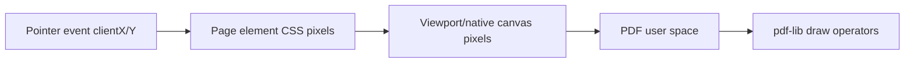

# Coordinate systems

Most rihaPDF interaction bugs are coordinate bugs. The app constantly converts between browser pixels, PDF.js viewport coordinates, CSS display scaling, and PDF user space.

## The coordinate spaces



## PDF vs browser axes

PDF user space is y-up from the bottom-left of the page. Browser layout is y-down from the top-left of the rendered page element.

The recurring conversion shape is:

```text
pdfX = viewportX / page.scale
pdfY = (page.viewHeight - viewportY) / page.scale
```

For text baselines there is an extra font-size adjustment because the browser box top is not the PDF baseline. Files such as `src/components/PdfPage/geometry.ts`, `InsertedTextOverlay.tsx`, and `arrivals.tsx` encode those baseline/box conversions.

## Scale terms

- `page.scale`: PDF.js render scale used for page geometry.
- `displayScale`: CSS/layout scale when the rendered page is displayed at a different size.
- device pixel ratio: browser backing-store multiplier, clamped by render guardrails.
- `effectiveScale`: hit-test/render scale used by some drag/cross-page overlays.

Do not mix these casually. A value in PDF points should not be multiplied by `displayScale` until it is being rendered as CSS pixels.

## Dragging and cross-page movement

Source images, inserted images, inserted text, comments, signatures, and redaction boxes can move or resize. Cross-page moves are represented by updating target slot/page identity, not by mutating the original source object into a different source.

The app often caches drag metadata at gesture start. That avoids re-reading DOM geometry while the pointer is moving and keeps cross-page drag previews stable.

## Resize handles

Resize handles work in screen/CSS space but commit PDF-space rectangles. Minimum sizes and handle positions are calculated in the overlay box's local dimensions, then converted back into PDF coordinates for saved state.

Redaction rectangles intentionally add a small visual bleed in the domain model so that stripped glyph pixels are fully covered even when browser/PDF antialiasing differs.

## Canvas and mobile guardrails

`src/pdf/render/guardrails.ts` clamps device pixel ratio and canvas dimensions. This is why very large pages still render instead of creating a backing store that crashes the browser.

Mobile layout adds another layer: fit-to-width pages, pinch/zoom, drawer chrome, and keyboard-aware toolbar placement. Mobile bugs often come from assuming desktop viewport height or unscaled page positions.

## Practical rules

- Name variables with their space when possible: `pdfX`, `viewHeight`, `fontSizePt`, `fontSizePx`.
- Convert at boundaries, not repeatedly in the middle of logic.
- For text, distinguish PDF baseline from browser box top.
- Test cross-page drag/resize on mobile and desktop after geometry changes.
- When a visual overlay and saved PDF disagree, inspect the exact coordinate-space conversion first.
