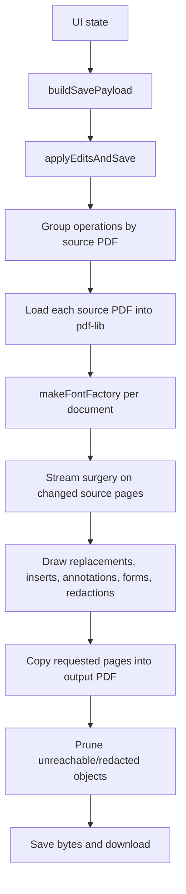

# Save pipeline

rihaPDF saves by copying source PDF pages into fresh in-memory PDFs, surgically removing source content that changed, drawing replacement/inserted content, then assembling those pages into the final output. This keeps original PDF structure where possible while avoiding the unsafe shortcut of drawing new content over old content.

## High-level flow

Key files:

- `src/app/buildSavePayload.ts` converts React state into save DTOs.
- `src/pdf/save/orchestrator.ts` coordinates the save.
- `src/pdf/save/context.ts` creates per-document font factories.
- `src/pdf/save/streamSurgery.ts` rewrites source content streams.
- `src/pdf/save/textDraw.ts` emits replacement and inserted text.
- `src/pdf/save/annotations.ts`, `src/pdf/save/forms.ts`, and `src/pdf/save/redactions/*` handle special PDF feature areas.

## Why the pipeline is document-scoped

pdf-lib objects belong to one `PDFDocument` context. Fonts, images, pages, and streams cannot be safely shared across loaded source PDFs. `makeFontFactory` is therefore created per source document and caches embedded fonts only inside that document.

Blank pages are synthetic slots. They do not have source runs/images/shapes, so they bypass stream surgery and receive only inserted content.

## Source content removal before drawing

Source text edits are not overlays. The old glyphs must be removed from the original content stream before replacement text is drawn. The stream-surgery pass handles:

- edited source text runs,
- deleted/moved source images,
- deleted vector-shape blocks,
- redaction glyph stripping,
- redaction image/vector/Form-XObject fallbacks.

This is deliberately conservative. If a partial rewrite is unsafe, rihaPDF removes a larger operation/block rather than risking recoverable hidden content.

## Draw plan ordering

After source cleanup, drawing operations are applied in a stable order so preview and save behavior stay understandable:

1. replacement text for edited source runs,
2. inserted text boxes,
3. inserted/moved images and visual signatures,
4. annotations,
5. form value updates,
6. redaction cover rectangles.

Redaction cover rectangles are drawn after underlying content removal so the visual black box is present in the saved PDF, but security does not depend on the cover alone.

## Font and text path

Text draw dispatch lives in `src/pdf/save/textDraw.ts`:

- Standard Latin fonts use pdf-lib's built-in Standard 14 path.
- Bundled Thaana fonts use HarfBuzz shaping and raw text operators. See [thaana-text-pipeline.md](thaana-text-pipeline.md).
- Mixed Latin + Thaana strings are segmented with `bidi-js` before shaping/drawing.

Measurements and drawing must use the same engine. Otherwise right-aligned RTL, decorations, wrapped text, and clipped inserted text drift.

## Page operations

The UI stores page order as slots: source pages, inserted blank pages, and imported pages from other PDFs. The save pipeline walks slots in display order and copies/emits the corresponding page into the output. Cross-page moves update the target slot/page metadata rather than mutating original source identity.

## Resource cleanup

PDF files can retain unreferenced objects if a stream merely stops using them. Redaction and image cleanup therefore also remove no-longer-used XObjects/resources where possible. This matters for privacy: a hidden or unreferenced image stream can still be recoverable from raw PDF bytes if serialized.

See [redaction-pipeline.md](redaction-pipeline.md) for the stricter cleanup rules used by redaction.

## Practical rules for changes

- Do not draw over old source content unless the old content is intentionally still present.
- Keep measurement and drawing engines paired.
- Prefer over-removal to under-removal for redaction/security paths.
- Add a fixture or E2E regression for every real PDF save bug.
- Run `pnpm.cmd run check` and relevant E2E tests after save-path changes.
