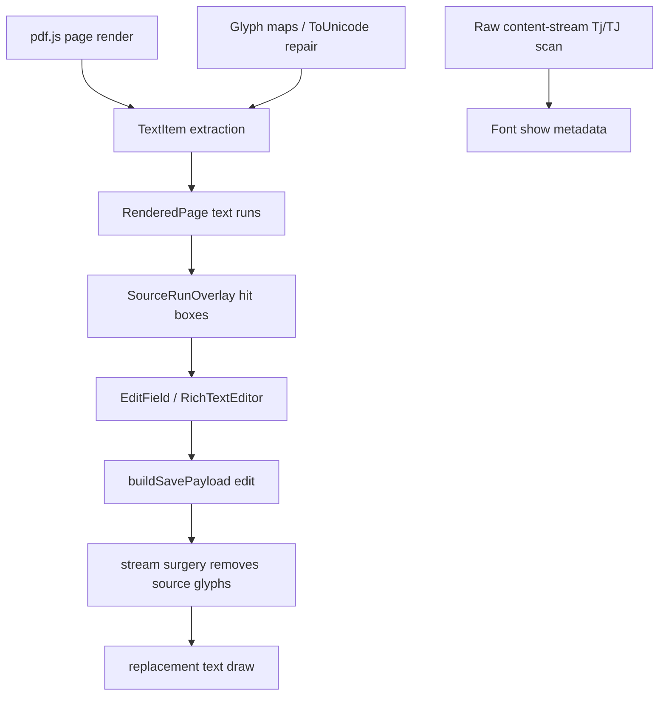

# Source text editing

Source text editing is the part of rihaPDF that makes an existing PDF feel editable. It has to bridge three different worlds: PDF.js text extraction, browser/Lexical editing, and pdf-lib content-stream rewriting.

## Flow

Key files:

- `src/pdf/render/pdf.ts` builds rendered page models from PDF.js output.
- `src/pdf/source/sourceFonts.ts` and related source modules inspect content-stream text shows.
- `src/components/PdfPage/SourceRunOverlay.tsx` displays selectable source runs and edit affordances.
- `src/components/PdfPage/EditField.tsx` mounts the source editor.
- `src/components/PdfPage/RichTextEditor*.tsx` handle rich editing and serialization.
- `src/components/PdfPage/rtlDisplayText.ts` contains editor-display compatibility fixes for RTL punctuation/date-like text.
- `src/pdf/save/streamSurgery.ts` removes old source glyphs during save.

## Extraction is not enough

PDF.js gives logical text items and viewport geometry, but not enough stable information to rewrite the original PDF. rihaPDF also scans source content streams to pair text items with their original `Tj`/`TJ` operations and glyph positions. That pairing is what lets save remove only the edited source glyphs instead of rasterizing the page or covering text with white rectangles.

Broken `/ToUnicode` maps are common in Maldivian PDFs. rihaPDF extracts font glyph maps and repairs known missing characters where possible so the editor sees real Unicode instead of dropped glyphs.

## Editing overlay vs saved result

The browser overlay is only the editing UI. For source text, the actual save does two things:

1. strips the original source glyphs from the content stream, and
2. draws new PDF text at the requested position/style.

During live editing, rihaPDF also shows white cover masks over the source run so users do not see old glyphs ghosting through the overlay before a debounced preview rebuild finishes. That visual mask is not the security mechanism; the save-time stream rewrite is.

## RTL display compatibility fixes

`displayTextForEditor` exists because some RTL text that extracts correctly from a PDF does not behave nicely in a browser editing surface. The function only changes the string shown in the editor/caret calculations; the save payload still preserves the intended logical text.

It handles several real-world annoyances:

- Date-like or number-group text such as `1/1/2000` can appear reversed or split by the browser bidi algorithm inside an RTL editor. Single-separator number groups are reversed for display so editing feels natural.
- Separators such as `/` and `:` get spaces tightened before following digits so date/time groups stay together.
- Punctuation next to RTL or digits can acquire visual gaps; spacing around punctuation is tightened except for opening punctuation.
- Trailing list dots are converted to leading list dots for RTL display, so numbered list markers appear where a Dhivehi user expects them.
- Leading section markers such as `.12` are displayed as `2-1` style markers where needed.

These rules look hacky because they are: they encode browser/PDF bidi edge cases found while testing real Maldivian documents. They should not be removed without reproducing the original cases.

## Caret mapping

Caret placement uses PDF-side glyph edge data when available. For RTL source runs, `SourceRunOverlay` maps raw logical prefixes through `displayTextForEditor` before calculating the displayed offset. This keeps clicking in source text, opening the editor, and committing replacement text from drifting around punctuation/number groups.

## Rich-text serialization

The rich editor stores formatted spans, strips bidi control characters, and serializes only supported styles into the save payload. Whole-editor font/font-size changes and selected-range changes both need to persist; this was a previous mobile/source edit bug and is covered by tests.

## Change rules

- Treat `rtlDisplayText.ts` as a compatibility layer, not pretty formatting.
- If changing caret/display logic, test dates, punctuation, parentheses, list markers, and mixed digits in RTL text.
- If changing source glyph pairing, inspect both visual output and extracted text from the saved PDF.
- Add E2E fixtures for every source-PDF bug; unit tests alone are not enough for stream surgery.
