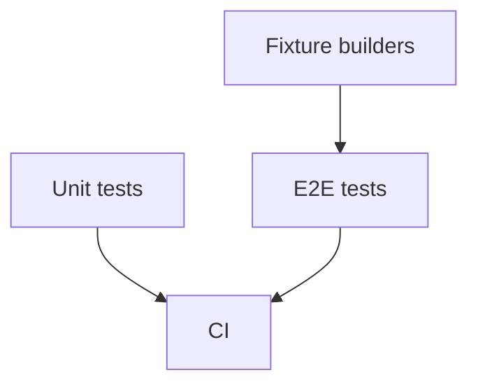

# Testing strategy

rihaPDF is now in bug-fix mode. The most valuable tests are regression tests for real PDFs and real browser/editor behavior.

## Test layers

## Unit tests

Unit tests are best for pure logic:

- rich-text serialization/model helpers,
- Thaana keyboard mapping and `beforeinput` handling,
- geometry helpers,
- content-stream tokenizers/planners where possible,
- redaction subroutines that can run without a browser.

They are fast and should be added for small bug fixes, but they cannot prove a saved PDF renders/extracts correctly in a browser.

## E2E tests

Playwright E2E tests protect the product behavior:

- opening PDFs,
- editing source text,
- inserted text/images/signatures,
- mobile layout and input,
- saving and re-opening output,
- redaction behavior,
- forms and annotations.

For user-visible PDF bugs, prefer an E2E regression because it exercises PDF.js, DOM layout, event handling, save output, and extraction together.

## Fixtures

Fixtures live under `test/fixtures/`. Real-world PDFs are valuable because many bugs come from weird producer output: broken `/ToUnicode`, odd fonts, compressed streams, unusual images, form hierarchies, and bidi edge cases.

When a ministry/user reports a PDF-specific bug:

1. reduce or sanitize the PDF if needed,
2. add it as a fixture or generate a minimal equivalent,
3. write the smallest test that fails before the fix,
4. fix the pipeline,
5. keep the fixture forever unless it contains private data.

## What to test for common bug classes

- **Source text editing:** visual replacement, old glyph removal, copy/search output, punctuation/date editing.
- **Thaana text:** visual fili placement, selectable text, mixed Latin/Thaana extraction caveats.
- **Forms:** `/V`, `/AS`, fresh text-widget `/AP /N`, `/NeedAppearances false` with explicit appearances, right alignment, Thaana default font, and reopen behavior without double-painted widget text.
- **Redaction:** no recoverable underlying text/images/annotations/forms, not just black pixels.
- **Coordinates:** drag/resize on desktop and mobile, cross-page movement, saved position.
- **Browser guardrails:** large files/pages fail clearly instead of crashing.

## Standard verification

For docs-only changes, `pnpm.cmd run check` is enough.

For code changes:

- run `pnpm.cmd run check`,
- run targeted unit/E2E tests for the touched area,
- run full E2E before release-ish pushes or risky save/render changes.

## Rule for bug-fix mode

Every real bug should leave behind either:

- a unit test for isolated logic, or
- an E2E/fixture regression for user-visible behavior.

No broad rewrites unless the bug proves the current structure cannot be safely fixed.
