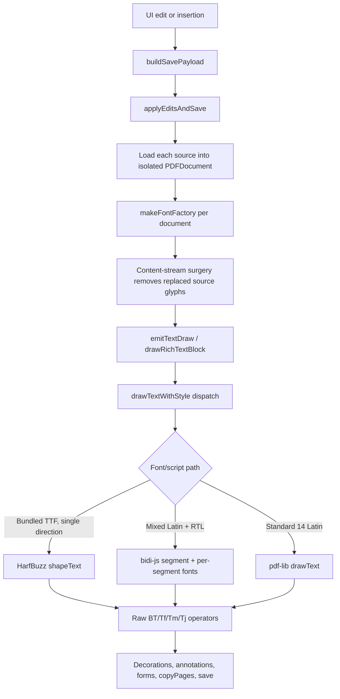

# Thaana text pipeline

This document explains how rihaPDF turns editable Dhivehi / Thaana text into saved PDF content that renders correctly and remains real selectable/searchable text. It covers source text edits, inserted rich text, FreeText annotation appearances, and AcroForm text-field appearance setup.

## Design goal

PDF libraries can write simple text, but Thaana needs complex-script shaping: base glyphs and fili marks must be positioned through OpenType GSUB/GPOS tables. rihaPDF therefore avoids `page.drawText` for bundled Thaana TTFs and writes shaped glyph IDs directly.

The save path must preserve three properties:

1. **Visual fidelity:** saved output should match the browser editor preview for Thaana, Latin, mixed-script text, formatting, alignment, and decorations.
2. **Real text:** output should be PDF text operators, not rasterized text, so users can select, copy, and search.
3. **PDF resource correctness:** every text operator must reference a page/Form resource font name, not a font's BaseFont name, and glyph IDs must match the embedded font.

## High-level flow



Main entry points:

- `src/pdf/save/orchestrator.ts` loads source PDFs, creates per-document font factories, runs stream surgery, and emits replacement text / inserted text before copying pages to the output.
- `src/pdf/save/textDraw.ts` handles rich-text wrapping, alignment, decorations, italic synthesis, measuring, and draw dispatch.
- `src/pdf/text/shape.ts` owns HarfBuzz WASM loading and returns shaped glyph IDs, advances, offsets, clusters, and direction.
- `src/pdf/text/shapedDraw.ts` converts one shaped run into raw pdf-lib operators.
- `src/pdf/text/shapedBidi.ts` handles mixed-script segmentation and visual ordering.

## Font loading and embedding

`makeFontFactory` in `src/pdf/save/context.ts` is bound to one `PDFDocument`. Fonts cannot be shared between documents because each document has its own object table.

For each `(family, bold, italic)` it returns:

- `pdfFont`: the pdf-lib embedded font.
- `bytes`: raw TTF bytes for bundled fonts, or `null` for Standard 14 fonts.

Bundled Dhivehi fonts are embedded with `subset: false`. That is intentional: HarfBuzz returns glyph IDs from the original TTF, and pdf-lib writes Type 0 / Identity-H fonts whose CIDs can map directly to those glyph IDs. With `CIDToGIDMap=Identity`, the emitted CID is the HarfBuzz glyph ID.

Standard 14 Latin fonts do not have raw bytes in the app, so they stay on the pdf-lib `drawText` path.

## Draw dispatch

`drawTextWithStyle` in `src/pdf/save/textDraw.ts` picks one of three paths:

1. **Mixed-script auto path** when `dir` is not explicitly set and the text contains both strong RTL codepoints and strong LTR letters. It calls `drawMixedShapedText`.
2. **Shaped TTF path** when the selected font has raw bytes. It calls `drawShapedText`, which shapes via HarfBuzz and writes raw text operators.
3. **Standard Latin path** when `bytes === null`. It calls pdf-lib `page.drawText`.

Measurement mirrors drawing through `measureTextWidth`. This is important for RTL right alignment, centered text, underlines, strikethroughs, wrapping, and justified text: if measurement and drawing use different engines, the saved text drifts.

## HarfBuzz shaping

`shape.ts` loads `harfbuzzjs` by importing the Emscripten factory directly and routing `hb.wasm` through Vite's asset URL. The HarfBuzz font object is cached by the exact `Uint8Array` of font bytes.

The main shaping functions are:

- `shapeRtlThaana(text, fontBytes)`: forces RTL direction, script `Thaa`, language `dhv`.
- `shapeAuto(text, fontBytes)`: routes any RTL-containing text to the Thaana path; otherwise lets HarfBuzz guess LTR segment properties.
- `shapeText` in `shapedDraw.ts`: small wrapper used by draw/measure callers.

A `ShapeResult` contains glyph IDs, advances, offsets, source clusters, units-per-em, metrics, and resolved direction.

## Operator emission

`drawShapedText` registers the embedded font on the target page with `page.node.newFontDictionary("RihaShaped", opts.font.ref)`. The returned resource name (for example `/RihaShaped-...`) is the name used in `Tf`.

This is the key PDF resource rule: `Tf` takes a **page resource name**, not the font's BaseFont string. Using the wrong name makes viewers fall back or render garbage.

`buildShapedTextOpsFromShape` emits:

- optional `q` + non-stroking color when a color override is present,
- `BT`, `Tf`, then repeated `Tm` + `Tj`,
- `ET`, and optional `Q`.

Each glyph is shown as a hex CID derived from the HarfBuzz glyph ID.

### LTR emission

LTR text walks HarfBuzz glyphs in buffer order. Each glyph gets its own text matrix at:

```text
x + (cursor + xOffset) * size / upem
y + yOffset * size / upem
```

Then the cursor advances by `xAdvance`.

### RTL emission

HarfBuzz returns RTL output in visual order. For text extraction, rihaPDF emits RTL clusters in logical stream order while preserving visual positions:

- group glyphs by HarfBuzz cluster,
- walk clusters in reverse buffer order,
- compute each cluster's visual x by subtracting its advance from the right-to-left cursor,
- emit glyphs within each cluster in reverse buffer order so Thaana base glyphs precede fili marks in the PDF stream.

This ordering is tuned for pdf.js-style extraction while keeping the visible glyphs in the same place.

## Mixed-script text

`shapedBidi.ts` handles strings such as `Hello ދިވެހި 42`.

The mixed path:

1. Uses `bidi-js` to compute embedding levels.
2. Splits text into level runs.
3. Picks a font by direction parity:
   - even/LTR segments use the Latin font,
   - odd/RTL segments use the Thaana font.
4. Measures each segment through the same engine that will draw it.
5. Reorders segments to visual order using UAX #9 rule L2.
6. Emits each segment at the cumulative visual x.

When the user's primary font is a Dhivehi font, Latin segments fall back to `Arial` from the registry. When the primary font is Latin, Thaana segments fall back to `DEFAULT_FONT_FAMILY` (`Faruma`).

## Rich text, wrapping, and decorations

`drawRichTextBlock` is used for source replacements with rich text, text inserts, alignment overrides, source paragraph rewrites, and clipped text boxes.

It is responsible for:

- splitting rich spans into lines,
- measuring with `measureTextWidth`,
- wrapping and soft line breaks,
- RTL visual token ordering for justified/tokenized lines,
- center/right/justify alignment,
- clipping inserted text boxes,
- drawing underline and strikethrough rules after text.

Italic for bundled Dhivehi fonts is synthesized with a shear-about-baseline graphics transform because those fonts do not ship native italic variants. Standard 14 Latin fonts use their real italic/oblique variants.

## Source edits vs inserted text

Source edits first go through stream surgery (`src/pdf/save/streamSurgery.ts`) to remove the original `Tj`/`TJ` operators inside the edited run's bounding box. The replacement draw is queued as a draw plan and later emitted by `emitTextDraw` onto the origin or target page.

Inserted text bypasses stream surgery. `applyEditsAndSave` calls `drawRichTextBlock` directly with the insertion rectangle, font style, alignment, and optional clip box.

Both paths converge on `drawTextWithStyle`, so shaping, measurement, colors, italic synthesis, mixed-script handling, and decorations stay consistent.

## Annotations and forms

### FreeText comments

`src/pdf/save/annotations.ts` writes highlights, ink, and FreeText annotations directly as PDF annotation dictionaries.

Thaana FreeText comments get a custom `/AP /N` Form XObject. The appearance stream uses `buildShapedTextOps` so the comment is pre-shaped with HarfBuzz instead of relying on a viewer's annotation renderer. The same Faruma font is also registered in `/AcroForm/DR/Font`, and `/DA` references it as a fallback for viewers that ignore the custom appearance.

### AcroForm text fields

`src/pdf/save/forms.ts` writes field values into `/V`, embeds the needed font resources, and attaches fresh widget `/AP /N` appearance streams for filled text fields. For RTL/Thaana text fields it embeds Faruma into `/AcroForm/DR/Font`, rewrites `/DA` to reference that font, sets `/Q 2` for right alignment, and draws the appearance with HarfBuzz-shaped glyph IDs.

AcroForm appearances intentionally use `buildVisualShapedTextOps`, not the page-content logical-order emitter. A widget `/AP` stream is visual compatibility data rather than the searchable source of truth, and several readers display the extraction-friendly RTL order backwards inside form appearances. `/V` remains the semantic field value for reload/extraction.

`/NeedAppearances` is kept false when these explicit appearances exist. Acrobat and Preview treat a true value as permission to regenerate from `/DA + /V`, and their form engines can reverse Thaana or drop edge vowel marks even when rihaPDF's shaped `/AP` is present.

## Known caveat: mixed-script extraction

Visual rendering for mixed Latin + Thaana runs is correct, but exact logical-order extraction can still be imperfect in pdf.js-like extractors when adjacent Latin and RTL glyph items are grouped on the same line. The project tracks this in `test/e2e/mixed-script.test.ts` and the README TODO.

Potential fix paths:

- emit one `Tj` per cluster with a `TJ` array for inter-glyph adjustments, so extractors treat each cluster as one item,
- or repair extracted text by re-clustering recovered codepoints after pdf.js extraction.

Pure RTL and pure LTR runs are not affected by that mixed-script ordering caveat.

## Regression coverage

Useful tests and docs:

- `test/e2e/mixed-script.test.ts` checks Latin + Thaana inserted text round-trips both spans.
- `test/e2e/edit-format.test.ts` and `test/e2e/insert-format.test.ts` cover formatting paths.
- `test/e2e/mobile-positioning.test.ts` covers edit positioning on mobile layout.
- `test/e2e/source-paragraph-wysiwyg.test.ts` covers paragraph WYSIWYG behavior.
- `test/unit/README.md` and `test/e2e/README.md` summarize broader coverage.

When changing the shaped text pipeline, run at least `pnpm run check` plus the relevant unit/e2e subset. For operator-emission changes, inspect a saved PDF in pdf.js and one external viewer if possible.
